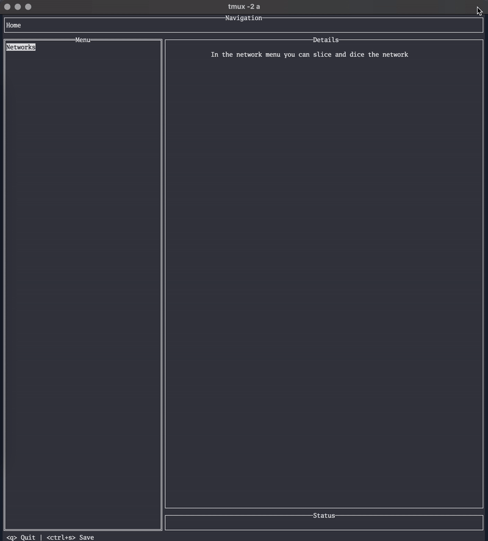

# EZ-IPAM

A lightweight, local-first IP Address Management tool. No database, no web server, no infrastructure - just a single binary that stores everything as Git-friendly YAML files.



## Why

Planning and documenting network address space shouldn't require deploying infrastructure to manage your infrastructure.

Tools like [NetBox](https://github.com/netbox-community/netbox) and [phpIPAM](https://phpipam.net/) are powerful, but they need a database, a web server, Redis, and real deployment effort. Visual subnet calculators like [davidc.net/subnets.html](https://www.davidc.net/sites/default/subnets/subnets.html) and [visualsubnetcalc.com](https://visualsubnetcalc.com/) are great for quick math, but they don't persist state and only let you annotate leaf subnets. Spreadsheets work until they don't.

EZ-IPAM fills the gap: a single binary you run locally that manages hierarchical network planning with full state persistence - and you can commit it all to Git.

### Design Principles

- **Local-first** - runs on your machine, works offline, no external services
- **Git-friendly** - state is stored as individual YAML files in `.ez-ipam/`, designed for minimal merge conflicts
- **Zero dependencies** - single binary, no database, no Redis, no web server
- **Read without the tool** - generates a human-readable [`EZ-IPAM.md`](./EZ-IPAM.md) report, browsable on GitHub or any markdown viewer
- **Comments everywhere** - annotate any level of the network hierarchy, not just leaf subnets

## Features

### Network Management
- **Hierarchical subnet planning** with IPv4 and IPv6 support
- **Three allocation modes**: Subnet Container (holds child networks), Host Pool (reservable IPs), and Unallocated
- **Split and summarize** - break down CIDRs into smaller subnets or merge contiguous unallocated ranges back together
- **IP reservations** with hostname, MAC address, and description

### Infrastructure Documentation
- **VLANs** - track VLAN IDs with names and descriptions
- **Security Zones** - group VLANs into logical trust zones
- **Equipment** - document routers, switches, and other network devices
- **Ports** - full port configuration including native/tagged VLANs, LAG groups, PoE, speed, and port-to-port connections
- **WiFi SSIDs** - track wireless network names
- **DNS Records** - A records, aliases to reserved IPs, MX, TXT, and more

### UX
- Terminal UI built with [tview](https://github.com/rivo/tview) - keyboard-driven, fast, works over SSH
- Context-sensitive keyboard shortcuts (press `?` for help)
- External editor support (`Ctrl+E`) for long descriptions via `$EDITOR`
- Fuzzy search for connecting ports and selecting items
- Markdown export with tree visualization and anchor links

## Installation

Download a pre-compiled binary from the [latest release](https://github.com/plumber-cd/ez-ipam/releases/latest).

Or build from source:

```bash
go install github.com/plumber-cd/ez-ipam@latest
```

## Quick Start

```bash
# Create a directory for your network documentation
mkdir my-network && cd my-network
git init

# Launch the TUI
ez-ipam
```

Navigate with arrow keys or `hjkl`, press `?` for context-sensitive help. All changes are saved to `.ez-ipam/` as YAML files and a summary is generated to `EZ-IPAM.md`.

### Recommended Git Workflow

```bash
# After making changes
git add .ez-ipam/ EZ-IPAM.md
git commit -m "Add production VPC subnet plan"
git push
```

The state is split into individual files per entity (one file per network, VLAN, etc.) to minimize Git merge conflicts when multiple people work on the same repository.

## How It Works

EZ-IPAM stores its state in the `.ez-ipam/` directory as a collection of YAML files, organized by entity type:

```
.ez-ipam/
  networks/       # CIDR blocks and their hierarchy
  ips/            # Reserved IP addresses
  vlans/          # VLAN definitions
  zones/          # Security zones
  equipment/      # Network devices
  ports/          # Port configurations
  ssids/          # WiFi SSIDs
  dns/            # DNS records
```

Every save is atomic (write to temp, then rename) to prevent corruption. The `EZ-IPAM.md` file is regenerated on each save, giving you a read-only view of your entire network plan without needing the tool.

This repository itself contains a `.ez-ipam` folder and [`EZ-IPAM.md`](./EZ-IPAM.md) as a working demo.

## Keyboard Shortcuts

| Key | Context | Action |
|-----|---------|--------|
| `?` | Anywhere | Show help |
| `n` | Networks folder | Add new root network |
| `a` | Unallocated network | Allocate as Subnet Container |
| `A` | Unallocated network | Allocate as Host Pool |
| `s` | Unallocated network | Split into smaller subnets |
| `S` | Unallocated network | Summarize (merge) contiguous ranges |
| `u` | Any allocated item | Update metadata |
| `d` | Allocated network | Deallocate |
| `D` | Any item | Delete |
| `r` | Host Pool network | Reserve an IP |
| `R` | Reserved IP | Unreserve |
| `v` | VLANs folder | Add VLAN |
| `z` | Zones folder | Add zone |
| `e` | Equipment folder | Add equipment |
| `p` | Equipment item | Add port |
| `C` | Port | Copy port |
| `c` | Port | Connect to another port |
| `x` | Connected port | Disconnect |
| `w` | SSIDs folder | Add WiFi SSID |
| `r` | DNS folder | Add DNS record |
| `Ctrl+E` | Text field | Open in `$EDITOR` |

## Acknowledgments

This project was inspired by:

- [davidc.net/subnets.html](https://www.davidc.net/sites/default/subnets/subnets.html) by David C
- [Visual Subnet Calculator](https://visualsubnetcalc.com/) - the successor to subnets.html
- [tview](https://github.com/rivo/tview) - the excellent Go TUI framework that made this possible

## Contributing

PRs are welcome! This project is focused on what matters for MY homelab, but contributions that expand its usefulness are appreciated. Feel free to fork it and make it your own.

## License

[Apache License 2.0](./LICENSE)
